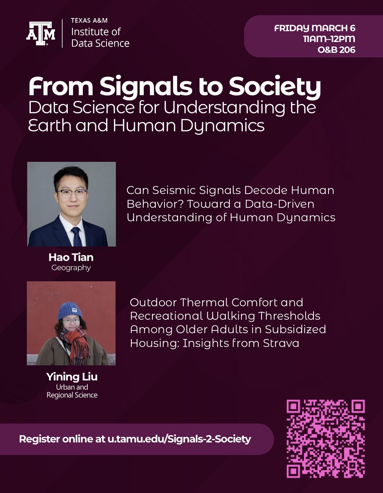

# From Signals to Society  
## Data Science for Understanding the Earth and Human Dynamics  

  

---

## 📌 Event Overview

**From Signals to Society** is a data science seminar hosted by the  
**Texas A&M Institute of Data Science (TAMIDS)**.

The event explores how advanced data science methods — from signal processing to spatial analytics — can help decode complex Earth systems and human behavioral dynamics.

This seminar brings together interdisciplinary research at the intersection of:

- 🌍 Geospatial Science  
- 📡 Signal Processing & Seismic Sensing  
- 🧠 Human Behavior Modeling  
- 🌡 Climate & Environmental Analytics  
- 🏙 Urban & Regional Science  
- 🤖 AI & Data-Driven Decision Systems  

---

## 🗓 Event Details

- **Date:** Friday, March 6  
- **Time:** 11:00 AM – 12:00 PM  
- **Location:** O&B 206  
- **Host:** Texas A&M Institute of Data Science  

🔗 Registration:  
https://u.tamu.edu/Signals-2-Society  

---

## 🎤 Speakers & Topics

### 🧠 Hao Tian  
**Department of Geography**

**Talk:**  
*Can Seismic Signals Decode Human Behavior? Toward a Data-Driven Understanding of Human Dynamics*

This talk investigates whether passive seismic signals can serve as a proxy for human activity patterns. By leveraging signal analytics and data science pipelines, the research bridges physical sensing systems with behavioral inference models, opening new possibilities for urban monitoring and social analytics.

---

### 🌡 Yining Liu  
**Urban and Regional Science**

**Talk:**  
*Outdoor Thermal Comfort and Recreational Walking Thresholds Among Older Adults in Subsidized Housing: Insights from Strava*

This presentation integrates mobility data, environmental sensing, and human-centered analytics to evaluate how outdoor thermal conditions influence walking behavior among older adults. Using crowd-sourced movement data (e.g., Strava), the study contributes to climate adaptation, health equity, and urban resilience research.

---

## 🎯 Seminar Objectives

This event aims to:

- Demonstrate how raw signals can be transformed into societal insight  
- Showcase interdisciplinary data science applications  
- Highlight emerging methods in spatial-temporal modeling  
- Connect environmental signals with human behavioral responses  
- Foster collaboration across geography, data science, and urban analytics  

---

## 🔬 Research Themes Highlighted

- Signal-to-Society Framework  
- Environmental Sensing & Behavioral Modeling  
- Spatial Data Science  
- Climate Adaptation & Urban Resilience  
- Human Dynamics in Built Environments  
- Data-Driven Public Health & Equity  

---

## 🤝 Organized By

Texas A&M Institute of Data Science (TAMIDS)  

---

## 📬 Contact

For questions about the event or related research collaboration, please contact the organizers or TAMIDS.

---

© Texas A&M University – Institute of Data Science  
