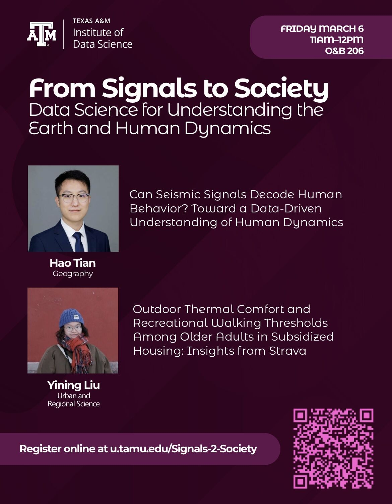

# From Signals to Society  
## Data Science for Understanding the Earth and Human Dynamics

<p align="center">
  
</p>

<p align="center">


</p>

---

## 📑 Table of Contents

- [Event Overview](#-event-overview)
- [Event Details](#-event-details)
- [Speakers & Topics](#-speakers--topics)
- [Seminar Objectives](#-seminar-objectives)
- [Research Themes](#-research-themes)
- [Slides & Materials](#-slides--materials)
- [About TAMIDS](#-about-tamids)
- [Acknowledgements](#-acknowledgements)
- [Contact](#-contact)

---

# 📌 Event Overview

**From Signals to Society** is a data science seminar hosted by the  
**Texas A&M Institute of Data Science (TAMIDS)**.

As a **TAMU Data Science Ambassador**, **Yifan Yang** co-organized this seminar with **Wenjing Gong** and **Weishan Bai** to foster interdisciplinary dialogue across data science, geography, and urban analytics at **Texas A&M University**.

The seminar explores how **environmental signals, sensing technologies, and data-driven modeling** can be transformed into insights about **human behavior, environmental systems, and urban dynamics**.

By bridging **physical sensing systems with advanced data science and GeoAI methods**, the event highlights emerging approaches to understanding complex **Earth–human systems**.

---

# 🗓 Event Details

| Item | Information |
|---|---|
| **Date** | Friday, March 6 |
| **Time** | 11:00 AM – 12:00 PM |
| **Location** | OMB 206, Texas A&M University |
| **Host** | Texas A&M Institute of Data Science (TAMIDS) |

🔗 **Event Details & Registration**  
https://lnkd.in/g45w3k58  

🔹 **Zoom Link**  
https://lnkd.in/gipy_9Q2  

🔹 **TAMU Attendees:** Please scan the QR code in the poster to register.

---

# 👥 Speakers

| Speaker | Affiliation | Topic |
|---|---|---|
| **Hao Tian** | Department of Geography, Texas A&M University | Seismic sensing and human dynamics |
| **Yining Liu** | Urban & Regional Science, Texas A&M University | Thermal comfort and walking behavior |

---

# 🎤 Speakers & Topics

## 🧠 Hao Tian  
**Department of Geography, Texas A&M University**

<p align="center">

</p>

### Talk  
**Can Seismic Signals Decode Human Behavior?  
Toward a Data-Driven Understanding of Human Dynamics**

This talk explores how **passive seismic sensing combined with data-driven modeling** can decode patterns of **human activity and mobility**, particularly under environmental stress and extreme weather conditions.

The research bridges **environmental sensing infrastructure and computational analytics**, demonstrating how seismic signals can serve as indirect indicators of human behavioral dynamics embedded within environmental data streams.

---

## 🌡 Yining Liu  
**Urban & Regional Science, Texas A&M University**

<p align="center">

</p>

### Talk  
**Outdoor Thermal Comfort and Recreational Walking Thresholds Among Older Adults**

This presentation investigates how **outdoor thermal conditions influence recreational walking behavior among older adults**.

By integrating **real-world activity data with environmental analytics**, the study contributes to research on:

- Urban resilience  
- Climate adaptation  
- Healthy aging  
- Climate-health interactions

The work provides insights for **climate-responsive urban planning and public health policy**.

---

# 🎯 Seminar Objectives

This seminar aims to:

- Transform **raw environmental signals into actionable societal insights**
- Demonstrate interdisciplinary applications of **GeoAI and spatial data science**
- Highlight emerging approaches in **spatiotemporal modeling**
- Connect **environmental sensing technologies with human behavioral responses**
- Strengthen collaboration across **data science, geography, and urban science**

---

# 🌍 Research Themes

The seminar highlights several emerging research directions in **GeoAI and environmental data science**.

### Environmental Sensing
- Seismic sensing systems  
- Passive environmental monitoring  
- Sensor-based human activity inference  

### Human Dynamics Modeling
- Human mobility modeling  
- Behavioral response to environmental stress  
- Data-driven analysis of urban dynamics  

### Climate & Environmental Analytics
- Thermal comfort modeling  
- Climate-health interactions  
- Urban climate resilience  

### GeoAI & Spatial Data Science
- Geospatial machine learning  
- Spatiotemporal modeling  
- AI-driven environmental analytics  

---

# 📂 Slides & Materials

Presentation materials are archived in this repository.

```
slides/
├── TAMIDS_Hao_Presentation_compressed.pdf
├── TAMIDS_YLiu_Pre_2026-03-06.pdf
```

These slides document the research presented during the seminar and serve as resources for researchers interested in **data-driven environmental sensing and human dynamics modeling**.

---

# 🏛 About TAMIDS

The **Texas A&M Institute of Data Science (TAMIDS)** promotes interdisciplinary data science research across the university.

TAMIDS connects researchers from fields including:

- Artificial Intelligence  
- Engineering  
- Environmental Science  
- Social Science  
- Health and Public Policy  

to develop **data-driven solutions to complex real-world challenges**.

🔗 https://tamids.tamu.edu

---

# 🙏 Acknowledgements

We sincerely thank the **Texas A&M Institute of Data Science (TAMIDS)** for supporting and organizing this event.

Special thanks to:

- **Drew Casey** — for coordination and event organization  
- **TAMIDS Data Science Ambassador Program** — for enabling interdisciplinary collaboration

---

# 📬 Contact

If you are interested in collaborations related to **GeoAI, environmental sensing, and spatial data science**, feel free to connect.

**Yifan Yang**  
PhD Student — Department of Geography  
Texas A&M University  

🌐 Personal Website  
https://rayford295.github.io

---

# 🧭 Keywords

GeoAI · Spatial Data Science · Human Dynamics · Urban Analytics · Environmental Analytics · GIScience

---

### TAMU #DataScience #GeoAI #UrbanAnalytics #HumanDynamics #TAMIDS #GIScience


